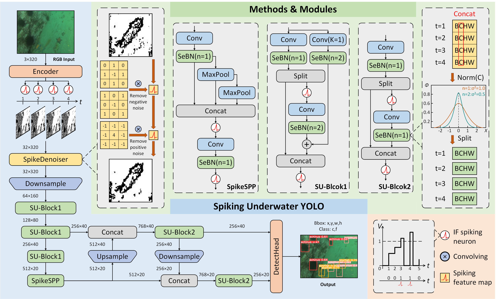

# SU-YOLO-Drone: Spiking Neural Network for Energy-Efficient Drone Object Detection

Adapted from [SU-YOLO](https://www.sciencedirect.com/science/article/pii/S0925231225009828) (Neurocomputing 2025) for drone-view object detection in adverse visibility conditions.

This repository extends the original SU-YOLO spiking neural network with **ghost convolutions**, **multi-scale small-object detection (P2/P3/P4)**, and **offline knowledge distillation** from a YOLOv9-C teacher. The models are designed for deployment on edge hardware (FPGA / neuromorphic chips) where energy efficiency is critical.



---

## Technical Background

### Spiking Neural Networks (SNNs)

Standard artificial neural networks (ANNs) use continuous-valued activations and multiply-accumulate (MAC) operations. Spiking neural networks instead communicate through **binary spikes** (0 or 1) across discrete time steps. This fundamental difference has two major consequences:

1. **Energy efficiency**: When a neuron does not spike (output = 0), downstream computations are skipped entirely. When it does spike (output = 1), the weight multiplication becomes a simple addition. On neuromorphic or FPGA hardware, this replaces expensive MAC operations with integer additions, reducing energy consumption by 10-100x compared to equivalent ANNs.

2. **Temporal dynamics**: SNNs process information across multiple time steps. Each time step produces a spike or silence based on the neuron's accumulated membrane potential. The `--time-step` parameter controls how many steps the network simulates. More steps generally improve accuracy but increase latency linearly. For real-time drone deployment, `time-step=1` provides the best speed-accuracy trade-off.

In SU-YOLO, we use **Integrate-and-Fire (IF) neurons** with surrogate gradient training (ATan surrogate function) from the [SpikingJelly](https://github.com/fangwei123456/spikingjelly) framework. The network is trained with standard backpropagation — the spiking behavior is handled transparently by the IF neuron layers.

### Ghost Convolutions

Ghost convolutions, introduced in [GhostNet (Han et al., CVPR 2020)](https://arxiv.org/abs/1911.11907), reduce convolution cost by observing that many output feature maps are similar to each other. Instead of generating all output channels with a full convolution, ghost convolutions:

1. Apply a **standard convolution** to produce a small set of *intrinsic* feature maps (e.g., half the output channels)
2. Apply **cheap linear operations** (depthwise convolutions) on those intrinsic features to generate the remaining *ghost* feature maps
3. **Concatenate** both sets to produce the full output

This roughly halves the computational cost while preserving representational capacity. In SU-YOLO-Drone, ghost convolutions are integrated with spiking neurons:

| Module | Description |
|--------|-------------|
| `SGhostEncoderLite` | Spiking stem with ghost convolution for initial feature extraction |
| `SGhostConv` | Spiking ghost convolution (replaces standard `SConv`) |
| `GhostBasicBlock1` | Backbone block with ghost convolutions for downsampling |
| `GhostBasicBlock2` | Neck/head block with ghost convolutions for feature fusion |

### Separated Batch Normalization (SeBN)

Standard Batch Normalization computes a single mean/variance across all inputs. In SNNs, the spike distribution varies significantly between time steps — early steps tend to have sparse, noisy activations while later steps stabilize. Applying the same normalization statistics to all time steps degrades performance.

**Separated Batch Normalization (SeBN)** maintains independent BN parameters for each time step, allowing the network to learn time-step-specific normalization. This captures temporal dynamics more effectively and is critical for spiking residual blocks where skip connections must preserve the temporal structure of spike trains.

### Multi-Scale Detection (P2/P3/P4)

Standard YOLO detectors use P3/8, P4/16, and P5/32 feature scales (where P*n*/*s* means the feature map is downsampled by stride *s* from the input). This works well for typical object sizes but misses very small objects.

Drone imagery presents a unique challenge: **objects are extremely small** due to the aerial perspective. A car at 1920x1080 might occupy only 15x10 pixels. At P3/8 stride, that car is less than 2x1 pixels in the feature map — too small for reliable detection.

SU-YOLO-Drone shifts the detection scales to **P2/4, P3/8, P4/16**, adding the higher-resolution P2 scale while dropping P5/32. This provides 4x more spatial resolution at the finest scale compared to standard YOLO, significantly improving small object detection from drone altitudes.

### Knowledge Distillation (KD)

Knowledge distillation transfers learned representations from a large, accurate **teacher** model to a small, efficient **student** model. SU-YOLO-Drone uses offline KD with a YOLOv9-C (GELAN-C) teacher:

- **Logit-level KD**: The teacher's classification logits are "softened" with a temperature parameter *T* (default 4.0) and used as soft targets for the student. The softer distribution reveals inter-class relationships (e.g., "this region is 70% car, 20% truck") that hard labels cannot express. Implemented as binary KL divergence with temperature-scaled sigmoid probabilities.

- **Feature-level KD**: Intermediate feature maps from the teacher's neck are used as regression targets for the student's neck features. Since the teacher has wider channels (256/512ch) than the student (64ch), learnable **1x1 convolution adapters** project the student features to the teacher's channel space before computing MSE loss.

- **Scale matching**: The teacher (P3/P4/P5) and student (P2/P3/P4) only share P3/8 and P4/16 scales. KD is applied only at these matched strides to ensure spatial alignment.

---

## Architecture

### Model Variants

| Config | Params | GOPS (est.) | Scales | Target |
|--------|--------|-------------|--------|--------|
| `su-yolo.yaml` | ~6.97M | ~35 | P3/16, P4/32 | Original (underwater) |
| `su-yolo-ghost.yaml` | ~3.5M | ~18 | P3/16, P4/32 | Ghost baseline |
| `su-yolo-720p-nano-ghost.yaml` | ~0.15M | ~3.4 | P2/4, P3/8 | Ultra-light 720p |
| `su-yolo-720p-mid-ghost.yaml` | ~0.5M | ~9 | P2/4, P3/8, P4/16 | **Primary drone model** |
| `su-yolo-1080p-ghost.yaml` | ~1.5M | ~20 | P2/4, P3/8, P4/16 | 1080p deployment |
| `su-yolo-1080p-2.5M-ghost.yaml` | ~2.5M | ~30 | P2/4, P3/8, P4/16 | High-capacity 1080p |
| `gelan-c.yaml` | ~25M | ~100+ | P3/8, P4/16, P5/32 | KD teacher (ANN) |

The primary model for drone deployment is **`su-yolo-720p-mid-ghost.yaml`** — a 3-scale detector with ghost convolutions at ~0.5M parameters and ~9 GOPS, targeting real-time inference on FPGA hardware.

### Backbone

```
Input (3, H, W)
  |
  SGhostEncoderLite ──> P1/2  (32ch)
  |
  GhostBasicBlock1  ──> P2/4  (64ch)
  |
  GhostBasicBlock1  ──> P3/8  (128ch)
  |
  GhostBasicBlock1  ──> P4/16 (128ch)
```

### Neck + Head (FPN)

```
P4/16 ─> SGhostConv(64) ─> Upsample ─> Cat(P3) ─> GBB2 ──> P3/8  (64ch)
                                                      |
P3/8 feat ──────────────── Upsample ─> Cat(P2) ─> GBB2 ──> P2/4  (64ch)
                                                      |
P2/4 feat ─> SGhostConv(stride=2) ─> Cat(P3) ──> GBB2 ──> P3/8  (64ch)
                                                      |
P3/8 feat ─> SGhostConv(stride=2) ─> Cat(P4) ──> GBB2 ──> P4/16 (64ch)
                                                      |
                                          SDDetect(P2, P3, P4)
```

`SDDetect` is the spiking detection head that outputs bounding box regression and classification logits. It uses `SDConv` (spiking depthwise convolution with temporal mean pooling) to aggregate spike trains from multiple time steps into a single output tensor.

---

## Datasets

### HazyDet (Drone-View Haze Detection)

3-class drone-view dataset for object detection under hazy/foggy conditions.

| Split | Images | Classes |
|-------|--------|---------|
| Train | 8,000 | car, truck, bus |
| Val | 1,000 | car, truck, bus |
| Test | 2,000 | car, truck, bus |

**Setup:**

```bash
# Download HazyDet from https://github.com/GrokCV/HazyDet
# Place at ../HazyDet relative to this repo

# Convert COCO JSON annotations to YOLO format
python tools/coco2yolo_hazydet.py --data-root /path/to/HazyDet
```

This creates `labels/` directories with YOLO `.txt` files alongside the `images/` folders.

### VisDrone (Drone Surveillance)

10-class drone surveillance dataset with dense urban scenes.

| Split | Classes |
|-------|---------|
| Train + Val | pedestrian, people, bicycle, car, van, truck, tricycle, awning-tricycle, bus, motor |

**Setup:**

```bash
# Download VisDrone2019-DET from https://github.com/VisDrone/VisDrone-Dataset
# Place at ../VisDrone relative to this repo

# Convert VisDrone annotations to YOLO format
python scripts/convert_visdrone_to_yolo.py --visdrone-dir /path/to/VisDrone
```

---

## Requirements

```
python >= 3.8
cuda >= 11.8
pytorch >= 2.0.0
torchvision >= 0.15.1
numpy < 2.0
spikingjelly >= 0.0.0.0.12
```

```bash
pip install -r requirements.txt
```

---

## Training

### Standard Training

```bash
# HazyDet — primary drone model (1920x1080)
python train.py \
    --cfg models/detect/su-yolo-720p-mid-ghost.yaml \
    --data data/hazydet.yaml \
    --hyp data/hyps/hyp.visdrone.yaml \
    --img 1920 --batch 6 --time-step 1 \
    --epochs 200 --cos-lr --device 0 \
    --name hazydet-mid-ghost

# VisDrone — 10-class drone surveillance (1280x720)
python train.py \
    --cfg models/detect/su-yolo-720p-mid-ghost.yaml \
    --data data/visdrone.yaml \
    --hyp data/hyps/hyp.visdrone.yaml \
    --img 1280 --batch 8 --time-step 1 \
    --epochs 200 --cos-lr --device 0 \
    --name visdrone-mid-ghost
```

**Key flags:**

| Flag | Description |
|------|-------------|
| `--time-step` | Number of SNN simulation steps (1 = fastest, 4 = original) |
| `--img` | Input resolution (1920 for HazyDet, 1280 for VisDrone) |
| `--cos-lr` | Cosine learning rate schedule |
| `--close-mosaic` | Disable mosaic augmentation for last N epochs (default: 15) |

### Knowledge Distillation

KD training is a 3-step pipeline:

**Step 1 — Train the GELAN-C teacher:**

```bash
python train.py \
    --cfg models/detect/gelan-c.yaml \
    --data data/hazydet.yaml \
    --hyp data/hyps/hyp.visdrone.yaml \
    --img 1920 --batch 6 --time-step 1 \
    --epochs 200 --cos-lr --device 0 \
    --name hazydet-teacher-gelanc
```

**Step 2 — Generate teacher outputs (offline):**

```bash
python generate_teacher_outputs.py \
    --weights runs/train/hazydet-teacher-gelanc/weights/best.pt \
    --data data/hazydet.yaml \
    --img 1920 --device 0 --batch-size 1 \
    --output-dir teacher_outputs
```

This saves per-image `.pt` files containing neck features (P3/8, P4/16, P5/32) and raw detection logits for each training image.

**Step 3 — Train student with KD:**

```bash
python train_kd.py \
    --cfg models/detect/su-yolo-720p-mid-ghost.yaml \
    --data data/hazydet.yaml \
    --hyp data/hyps/hyp.visdrone.yaml \
    --img 1920 --batch 6 --time-step 1 \
    --epochs 200 --cos-lr --device 0 \
    --teacher-outputs teacher_outputs \
    --kd-alpha 1.0 --kd-beta 0.5 --kd-temperature 4.0 \
    --name hazydet-student-kd
```

**KD hyperparameters:**

| Flag | Default | Description |
|------|---------|-------------|
| `--kd-alpha` | 1.0 | Weight for logit KD loss (soft label transfer) |
| `--kd-beta` | 0.5 | Weight for feature KD loss (neck feature alignment) |
| `--kd-temperature` | 4.0 | Temperature for softening logits (higher = softer) |

Feature KD is automatically enabled only during the last `--close-mosaic` epochs (default 15) when mosaic augmentation is turned off, ensuring spatial alignment between student and teacher features. Logit KD is active throughout training.

---

## Evaluation

```bash
# Single model evaluation
python val.py \
    --data data/hazydet.yaml \
    --weights runs/train/hazydet-mid-ghost/weights/best.pt \
    --img 1920 --batch 8 --device 0 --time-step 1

# Evaluate across all HazyDet splits (clean, hazy, real-world)
bash tools/eval_all_splits.sh
```

---

## Results

### HazyDet

| Model | Params | GOPS | mAP@0.5 | mAP@0.5:0.95 |
|-------|--------|------|---------|---------------|
| SU-YOLO-Nano-Ghost | ~0.15M | ~3.4 | — | — |
| SU-YOLO-Mid-Ghost | ~0.5M | ~9 | — | — |
| SU-YOLO-Mid-Ghost + KD | ~0.5M | ~9 | — | — |
| SU-YOLO-1080p-Ghost | ~1.5M | ~20 | — | — |
| GELAN-C (teacher) | ~25M | ~100+ | — | — |

### VisDrone

| Model | Params | GOPS | mAP@0.5 | mAP@0.5:0.95 |
|-------|--------|------|---------|---------------|
| SU-YOLO-Mid-Ghost | ~0.5M | ~9 | — | — |
| SU-YOLO-1080p-Ghost | ~1.5M | ~20 | — | — |

*Results will be updated after training completes.*

---

## Project Structure

```
SUYOLO-drone/
├── models/
│   ├── detect/              # Model architecture YAMLs
│   ├── spike.py             # SNN modules (SConv, SDConv, SDDetect, SeBN, IF neurons)
│   └── yolo.py              # DDetect (ANN detection head for teacher)
├── utils/
│   ├── loss_tal.py          # Task-aligned loss + DistillationLoss
│   └── dataloaders.py       # DataLoaders including KD-aware variant
├── tools/
│   ├── coco2yolo_hazydet.py # HazyDet COCO→YOLO label conversion
│   ├── compute_gops.py      # GOPS computation utility
│   └── eval_all_splits.sh   # Multi-split evaluation script
├── scripts/
│   └── convert_visdrone_to_yolo.py  # VisDrone annotation conversion
├── train.py                 # Standard training script
├── train_kd.py              # Knowledge distillation training script
├── generate_teacher_outputs.py  # Teacher feature/logit extraction
├── val.py                   # Evaluation script
└── data/
    ├── hazydet.yaml         # HazyDet dataset config
    ├── visdrone.yaml         # VisDrone dataset config
    └── hyps/                # Hyperparameter configs
```

---

## Citation

```bibtex
@article{LI2025130310,
  title   = {SU-YOLO: Spiking neural network for efficient underwater object detection},
  journal = {Neurocomputing},
  volume  = {644},
  pages   = {130310},
  year    = {2025},
  issn    = {0925-2312},
  doi     = {https://doi.org/10.1016/j.neucom.2025.130310},
  url     = {https://www.sciencedirect.com/science/article/pii/S0925231225009828},
  author  = {Chenyang Li and Wenxuan Liu and Guoqiang Gong and Xiaobo Ding and Xian Zhong},
}
```

---

## Acknowledgments

Thanks to [Chenyang Li](https://github.com/CaoJu600) for his contribution to building the original SU-YOLO project.

For issues, please submit a GitHub issue. For other communications, contact `chenyang@ctgu.edu.cn` and `lwxfight@126.com`.
